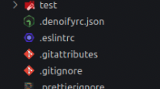

# 🔧 Build options


The Denoify configurations used to be specified [in the `package.json`](https://github.com/garronej/my\_dummy\_npm\_and\_deno\_module/blob/346b2291366aa7ef76ec0bde113699d84e65ed9e/package.json#L19-L36) file. It's still supported for legacy reasons but you are now encoraged to use a configuration separate configuration file. &#x20;


<figure><figcaption>
The configuration file as shown when using the vscode-icons extension (soon)
</figcaption></figure>

Denoify be looking in the root of your project for a `.denoifyrc.json`, `.denoifyrc.yml` or `.denoifyrc.js` configuration file. Pick the format that is more conveignent for you. &#x20;

### Options

#### replacer

* Type: `string?`

The function provided by users as a plugin that enable them to write custom logic that dictates how certain imports should be replaced

#### ports

* Type: `{ [portName: string]: string` `}`

#### out

* Type: `string?`
* Default: `deno_dist`

The directory for `denoify` to transpile to

#### index

* Type: `string?`
* Default: `src`

The entry point for `denoify` to output `mod.ts`

#### inclues

* Type: `string | { src: string, destDir?: string, destBasename?: string` }

### Recommendation

We strongly suggest to not use `package.json` as a configuration tool because it would reduce the readability of the `package.json` as it is stuff with unnecessary key-value pairs

We support `package.json` for backward compatibility purpose only
