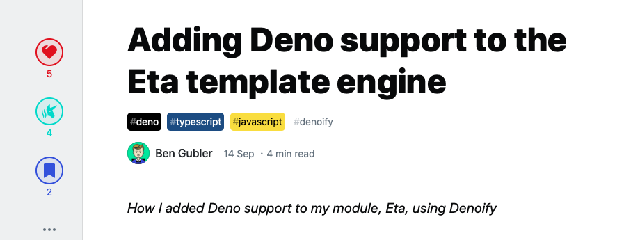

# Quick start


I acknowledge that this project calls for a better, more exhaustive, documentation. It's coming.


## A documented success story

You can check out the article wrote by the author of [the Eta template engine](https://eta.js.org).

\*\*\*\*[**Link to the DEV.to article**](https://dev.to/nebrelbug/adding-deno-support-to-the-eta-template-engine-28n7)\*\*\*\*

## Complete guide

You should be able to find everything there is to know about denoify by reading the `README` of [this](https://github.com/garronej/my_dummy_npm_and_deno_module) repo. 

\*\*\*\*[**Link to the GitHub repo**](https://github.com/garronej/my_dummy_npm_and_deno_module)\*\*\*\*

## Other tutorials

* \*\*\*\*[**Как портировать модуль с Node на Deno**](https://habr.com/ru/company/vdsina/blog/527540/)\*\*\*\*

